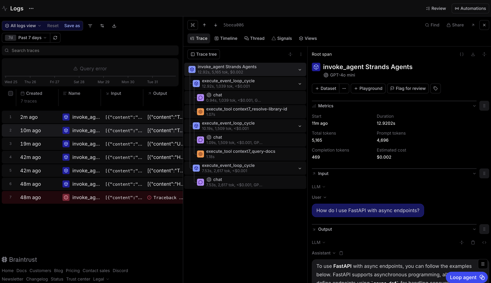

# MCP Observability Analysis

_Screenshot of Context7 MCP tool invocation inside a Braintrust trace._

As shown in the screenshot, the Context7 MCP tools are invoked directly inside the Braintrust trace, marked with the orange tool icon. What stood out to me is that Braintrust makes the hierarchy of operations very easy to follow. The trace shows the agent starting at the top-level invoke_agent span, then moving through multiple event loop cycles, model chats, and tool calls before producing the final answer. This made it much easier to see exactly where the MCP tools fit into the response process.

The flow of the trace looks like this:

1. invoke_agent
2. execute_event_loop_cycle
3. chat
4. execute_tool context7_resolve-library-id
5. execute_event_loop_cycle
6. chat
7. execute_tool context7_query-docs
8. execute_event_loop_cycle
9. chat

Compared to the earlier DuckDuckGo-only run, this MCP-based run adds another layer of tool orchestration. Instead of just making one search call and returning a response, the agent first resolves the correct library, then queries the documentation, and only after that generates the final answer. I connected the agent to the Context7 MCP server at `https://mcp.context7.com/mcp`, and Braintrust made it clear that these MCP tool calls were nested inside the same overall trace just like the regular DuckDuckGo tool calls. One interesting difference is that DuckDuckGo acts more like a general-purpose search tool, while the Context7 MCP tools are much more specialized for technical documentation, so the trace reflects a more structured and step-by-step retrieval process.
