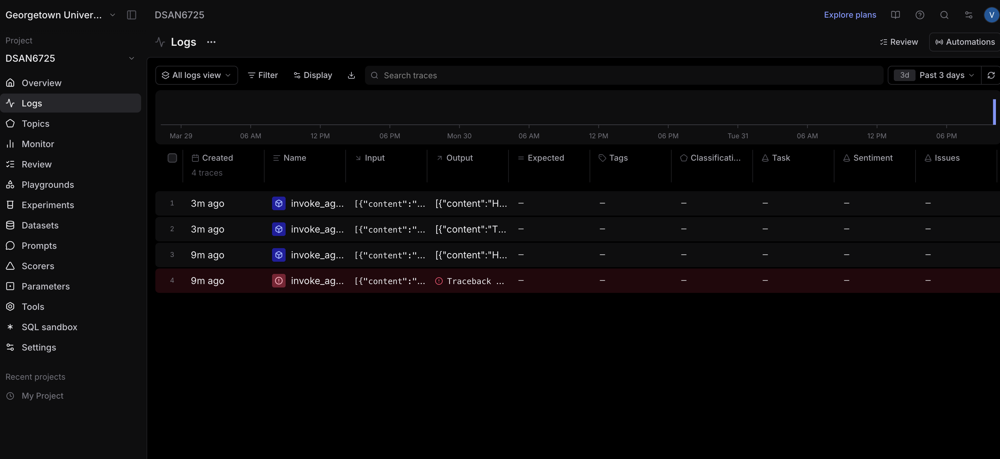
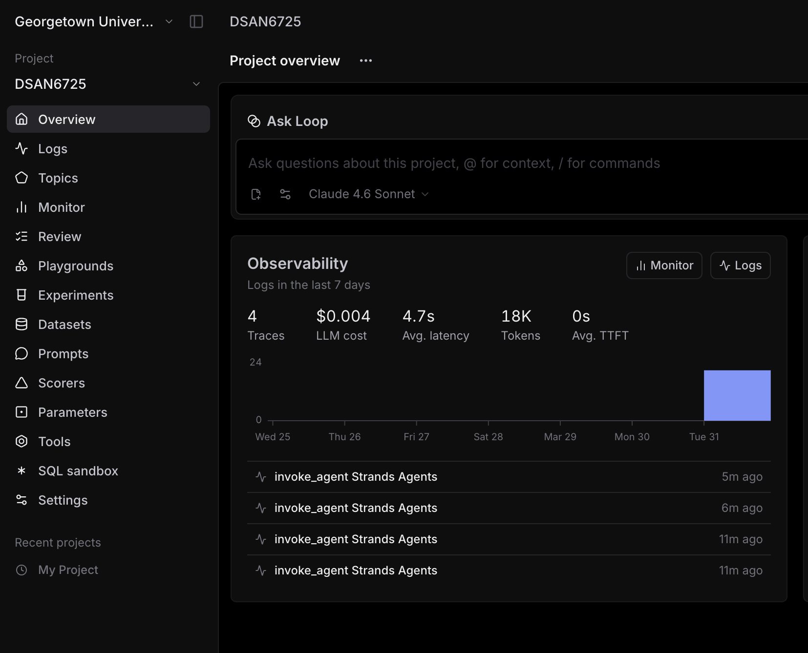
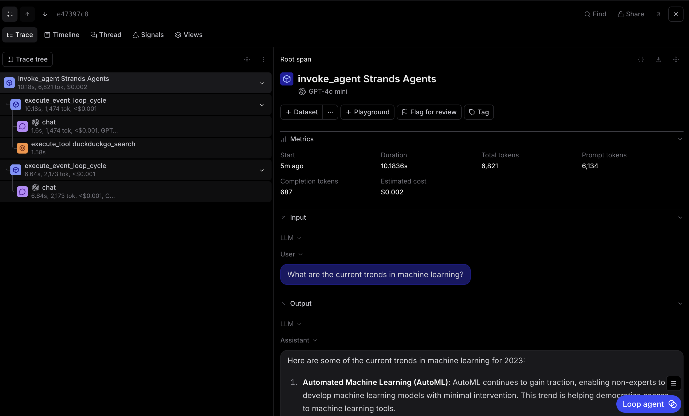

# Braintrust Observability Analysis

**NOTE**: This was all written with my ideas and words, but I did leverage AI to polish my grammar and repetitions, and formatting the images.

I pay for ChatGPT so I already have an OpenAI API key and didn't want to pay for an Anthropic key. On my first run, I forgot to account for the fact that I hadn't loaded any money into my Anthropic account, so the calls failed when I ran the script without configuring a backup paid API key. You can see in the Braintrust dashboard that this failed run is clearly denoted in red as a failure:

It only shows one trace because it failed right away. You can see that there are three successful traces for the three questions I asked (I took the same ones directly from EXERCISE.md).

In terms of metrics and patterns, the successful OpenAI runs follow a consistent pattern: the first LLM request returns quickly, DuckDuckGo search runs next, then a second LLM request synthesizes the answer. I noticed that tool-based questions took several seconds end-to-end because the workflow includes multiple external calls. The "latest news about AI" and "machine learning trends" questions likely involved broader search results and more synthesis, while the Nobel Prize question was more specific and probably easier for the agent to answer cleanly after one search.

Overall, it was really interesting to watch the traces in real time in the terminal to follow along actively as the script ran. I was able to understand the trace hierarchy for a successful query: each user question appears as a top-level agent run, with nested spans for model calls and the `duckduckgo_search` tool call. From the logs, I observed that the OpenAI-backed runs show a first model call, then a tool invocation, then a second model call that uses the tool results to produce the final answer. The dashboard provided an additional layer of understanding—it made it easier to see the bigger picture of the traces and logging in a more interactive and intuitive way.

